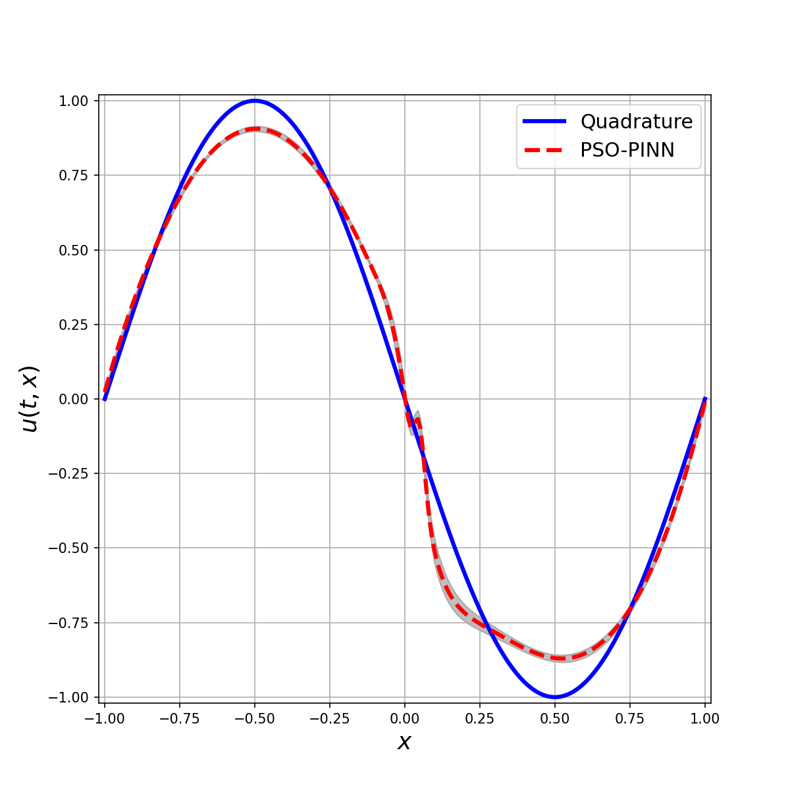

# aidaralimbayev.github.io

My personal web page. For research activities

https://aidaralimbayev.github.io/index.html

## [Getting Start](#setup-virtual-environment)

## Some preliminary results:

### Burgers equation:

 

### PSO:

 

## Deploying to GitHub Pages

1. Push the latest changes to the default branch (usually `main` or `master`).
2. In GitHub, open **Settings → Pages** and select the source as the repository root (branch `main`, folder `/`), then save.
3. GitHub Pages will build and publish to `https://<your-username>.github.io/aidaralimbayev.github.io/`. Changes appear after a short delay; refresh with cache disabled if needed.
